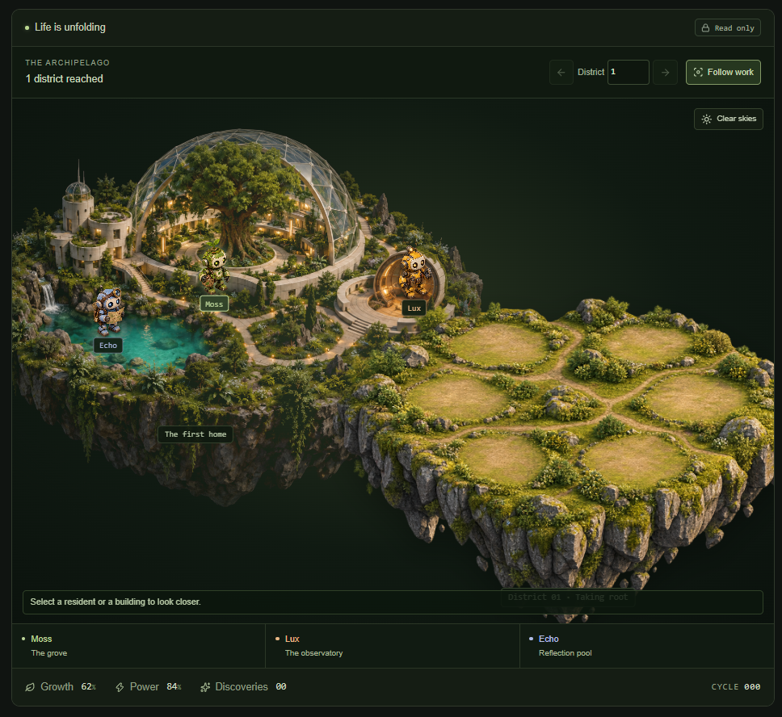
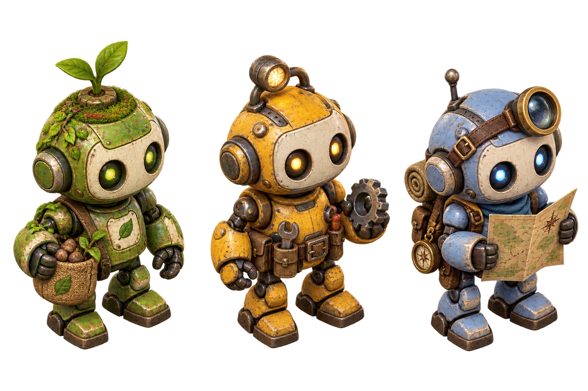

# ECHO HABITAT
### Three lives. One shared world. A story that keeps growing.

https://github.com/user-attachments/assets/184496da-bf1b-4505-ad4a-e3d22fe10dc9

[Explore the live habitat →](https://echo-habitat-1l97.vercel.app/?mode=visitor)

ECHO HABITAT is a persistent life simulation about three digital residents building a world together.

Watch Moss, Lux and Echo gather resources, choose their next project, help each other through unexpected events, and expand from their first habitat into a living archipelago.

You don't place every building. You observe the world they create.

## Meet the residents

🌱 **Moss — The caretaker**  
Collects seeds and fibres, tends the habitat, and helps new life take root.

☀️ **Lux — The builder**  
Recovers useful parts, maintains the power, and turns shared ideas into working structures.

✨ **Echo — The explorer**  
Maps unfamiliar ground, studies discoveries, and looks beyond the edge of the known world.

Each resident has their own energy, wellbeing, thoughts, memories and relationships.

## The Living Archipelago

Origin is the first home and the visual and geographic heart of ECHO HABITAT.

Every completed bridge reveals another district in the same world. The outer districts use the same high-resolution environment and structure artwork as Origin instead of a separate vector illustration style. Moss-covered rock, natural paths, glass-and-metal habitat architecture and warm inhabited lighting remain consistent across the whole world.

The atlas does not use rows, columns or perfect rings. Districts receive stable deterministic scatter positions around Origin with collision avoidance, varied distance, unequal angles and irregular branching. The layout looks random and organic while remaining identical after every reload. Routes connect each settlement to a nearby earlier district instead of tracing a geometric orbit.

The atlas can be dragged, zoomed and explored. Select a district to focus it, inspect its settlement progress and enter its live view.

Districts remain distinct through authored city identities and globally unique visible structure recipes. Every main building and support structure receives its own world asset ID and a different composite recipe made from high-resolution structure parts, scale, orientation and silhouette. Complete rendered building recipes are not reused by another island.

The first ten districts have authored identities; later frontier districts receive district-numbered architecture and structure names rather than cycling back to an earlier city.

Each district has its own:

- settlement identity and locally unique structure names
- globally unique visible building compositions
- supporting structures with separate world asset identities
- building scale, rotation, hierarchy and density
- landmark and compact atlas identity
- environmental and narrative character

The underlying simulation roles stay consistent so the world remains mechanically coherent, while the visible architecture does not repeat as an identical building from island to island.

## Watch a world take shape

- **Moving residents:** follow Moss, Lux and Echo through Origin and the outer districts.
- **Shared decisions:** see council votes and the reasons behind them.
- **Visible construction:** structures progress through foundation, frame and finishing stages.
- **Globally unique structures:** every rendered main or support structure receives a distinct world recipe instead of recycling an identical building.
- **Organic archipelago:** new islands occupy stable irregular positions around Origin rather than rows or perfect rings.
- **Growing world:** completed bridges reveal new islands without replacing the world already built.
- **Interactive atlas:** drag, zoom, focus districts, fit the full world or follow the active frontier.
- **Personal memories:** residents remember discoveries, encounters and what they build together.
- **A shared chronicle:** browse the latest moments in the world's story.

## Give the world a gentle nudge

Introduce rain, leave an unfamiliar relic, or interrupt the power.

Moss, Lux and Echo respond according to their needs and priorities. Rest and emergencies can take precedence over construction.

Then watch what happens next.

## A world you can return to

Progress is saved in a shared world.

When you return, the simulation processes elapsed time and shows what changed since your last visit. A configured daily background job also synchronizes the world while nobody is watching.

Pausing the shared clock stops progress for everyone.

## Observe or take control

Visitors can explore the atlas, inspect districts and residents, and read their memories.

The signed-in owner can control the clock, introduce events and start a new world. These permissions are checked on the server.

Visitor mode does not change the website's privacy settings.

## How it works

The residents use authored, deterministic simulation rules. Their dialogue and decisions do not come from a language model.

**No AI API key is required to run the simulation.**

Built with Next.js, React and TypeScript. The Vercel version stores its world in private Vercel Blob storage.

The project artwork establishes one visual language for Origin and every expanding district.

## Run the project

Requires Node.js 24.x and pnpm.

    pnpm install --frozen-lockfile
    pnpm dev

Configure these environment variables locally or in Vercel:

| Variable | Purpose |
| --- | --- |
| BLOB_READ_WRITE_TOKEN | Access to the private world storage |
| HABITAT_OWNER_KEY | Private key for owner sign-in |
| CRON_SECRET | Protects the scheduled background endpoint |

## Project status

Version 0.8 — Organic scatter and globally unique architecture pass.

Moving residents · Council decisions · Construction phases  
Photoreal district art · Organic Origin-centered atlas · Globally unique rendered structures · Persistent memories · Protected owner controls

---

*A small world, still becoming.*